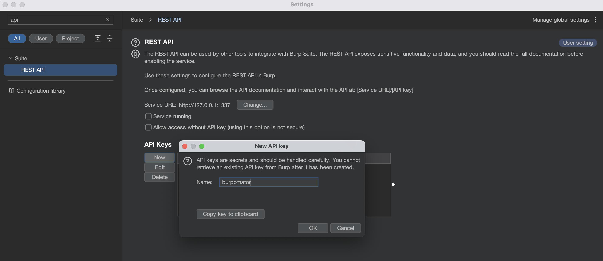
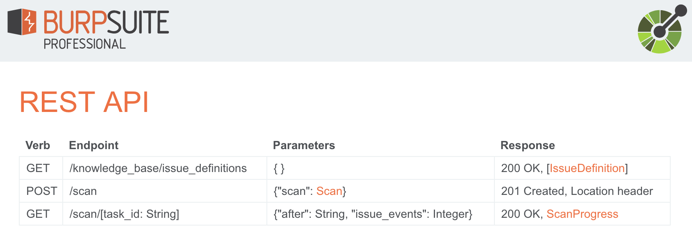

# burpomator

A small python script to get started with automating BURP Professional scans via REST API

## Usage:

Create a Python virtual environment

`python3 -m venv venv`

`source ./venv/bin/activate`

Install packages

`pip install -r requirements.txt`

Create an API key

Put the key in your .env file

`echo API_KEY="<api_key>" > .env`

Run burpomator

`python3 burpomator.py`

---

(optional) Check out the API specs at

`http://127.0.0.1:1337/<api_key>`

